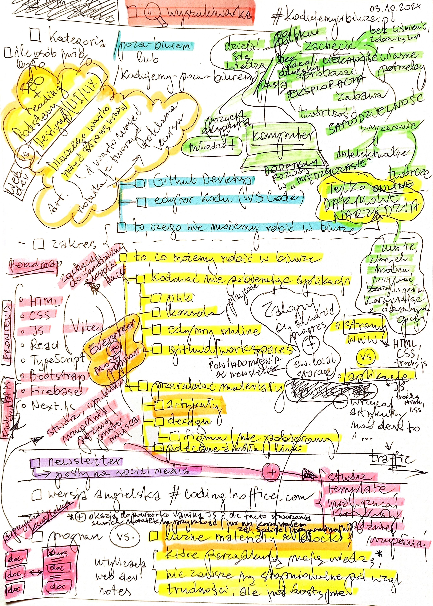

# TODO

- ## 🚀 NEXT ACTION 🚀
  - decide what next action should be...
- ## CSS
  - try to remove context vars (showOffset, lessThan992) & rely on CSS only to rewrite as much as possible to server components
  - nav links or margin too small mx
  - fix highlighting code in light mode + not highlighted separated single line code snippets
- ## CMS
  - refactor content & CMS, because now articles are stored in md in /public, courses stored as const in js in /[course]
  - fetching articles & sections & courses is not as efficient as it could be
- ## ARTICLES add
  - Czy warto (uczyć się) kodować w dobie AI?
    - (+) jak wykorzystać AI w nauce?
  - Dlaczego warto kodować w biurze?
  - Jak wykorzystałem (więc i Ty możesz) umiejętność programowania w swojej pracy (urlop app, odpady kalkulator app)?
- ## ONLINE EDITOR suggest to work with
  - with/without login
  - od razu zasugerować gh codespaces?? => zachęcić, by od razu ogarnąć gh? ale czy to nie jest za dużo na początek programowania?
  - dwa powyższe rozwiązania umożliwiają publikację aplikacji/stron!
  - adjust content to it
- ## Complete content basic topics:
  - objects
  - ...
- ## PROMOCJA
  - po poprawkach (wybierz, które są minimalnie niezbędne), ponownie promuj kurs wśród pracowników biurowych
    - LinkedIn
    - mailowo
      - urzędy
      - firmy
- add tech stack to /o-autorze & technical details as a route page article?
- ~~find recent visual TODO note &~~ extract todos from [this note below 👇](./TODO-2024-10-03-kodujemywbiurze-visual-note.jpg) 
- ~~publish new next.js (dirty) rewrite~~
  - ~~rewrite css => modules => decompose everything & recompose gradually to fix style errors~~
    - ~~then remove styled components, uninstall it & remove all "use client"s needed previously for styled component~~
  - ~~rewrite `PrevNextArticle`~~
    - ~~hero section img in / smaller than in original~~
  - ~~add GA~~
  - ~~README~~
    - ~~info about rewrite in next.js & prev svelte backup + general tech stack~~
